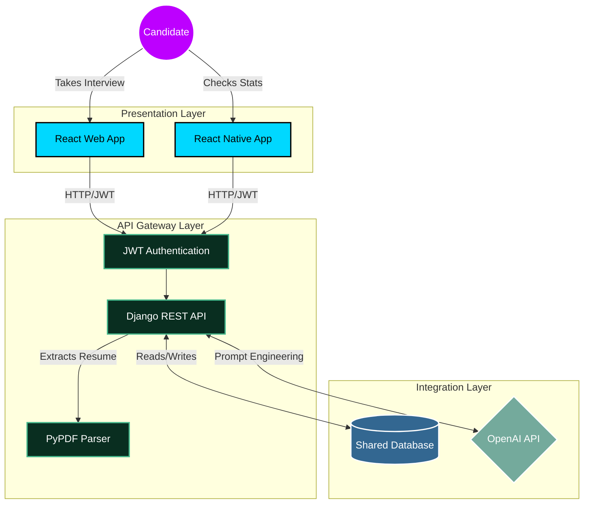

<div align="center">
  
# 🦅 InterviewHawk
**An AI-Powered Career Coach & Technical Interview Simulator**

[](https://reactjs.org/)
[](https://reactnative.dev/)
[](https://www.djangoproject.com/)
[](https://openai.com/)

[**Live Web Demo**](https://your-vercel-link.com) | [**Demo Video**](https://youtube-or-loom-link.com)

</div>

## 🚀 The Vision
Preparing for technical interviews is often a disconnected, generic experience. Traditional platforms offer standard algorithmic challenges but fail to assess a candidate's actual past work. **InterviewHawk** bridges this gap. 

By leveraging Generative AI and Document Parsing, InterviewHawk acts as a personalized career coach. It digests a candidate's uploaded resume and conducts a dynamic, project-specific interview, complete with adaptive difficulty scaling and an intelligent grading rubric. Built with a decoupled Service-Oriented Architecture, the platform seamlessly synchronizes data across a React web portal and a React Native mobile companion app.

---

## 📸 Platform Previews

<div align="center">
  
  
</div>

---

## 🛠️ Technical Stack

**Frontend (Web)**
* **React.js**: Component-driven UI and client-side routing.
* **Axios**: Intercepting and managing HTTP requests with JWT headers.
* **Vercel**: Edge-network deployment and CI/CD.

**Mobile Companion App**
* **React Native & Expo**: Cross-platform (iOS/Android) mobile development.
* **Expo SecureStore**: Encrypted local storage for authentication tokens.

**Backend & AI Services**
* **Python / Django REST Framework (DRF)**: Core API gateway and business logic.
* **SimpleJWT**: Secure, stateless user authentication.
* **PyPDF**: Server-side document text extraction.
* **OpenAI API (GPT-4o-mini)**: Advanced prompt engineering for context-aware question generation and response evaluation.
* **PostgreSQL / SQLite**: Shared relational database for cross-platform state management.
* **Render**: Cloud application hosting.

---

## 🧠 System Architecture

InterviewHawk relies on a decoupled Client-Server model. Both the Web and Mobile clients consume the same RESTful API endpoints, ensuring instantaneous synchronization of interview sessions, scores, and team analytics.




## ✨ Core Engineering Features

### Context-Aware Prompt Engineering
The backend doesn't just pass text to an LLM. It structures the extracted PDF data alongside specific difficulty parameters (Easy/Medium/Hard) and enforces a strict JSON-output schema for the grading rubric.

### Cross-Platform State Synchronization
By utilizing a unified Django REST backend, an interview completed on the web portal instantly updates the team analytics dashboard on the React Native mobile app.

### Constructive Evaluation Engine
The AI is tuned to act as a mentor, establishing a baseline score for genuine attempts and providing actionable, constructive feedback rather than binary pass/fail results.

### Secure Access Control
Implemented JWT (JSON Web Tokens) to ensure user data isolation, preventing candidates from accessing unauthorized team histories via API manipulation.

---

## 💻 Local Setup & Installation

If you'd like to run the InterviewHawk ecosystem locally, follow these steps:

### 1. Clone the Repository

```bash
git clone https://github.com/yourusername/interviewhawk.git
cd interviewhawk
```
## 💻 Local Setup & Installation

### 2. Backend Setup (Django)
```bash
cd backend
python -m venv venv
source venv/bin/activate  # On Windows use venv\Scripts\activate
pip install -r requirements.txt
# Create a .env file and add your OPENAI_API_KEY
python manage.py migrate
python create_admin.py # Seeds the DB with test users
python manage.py runserver
```

### 3. Web Frontend Setup (React)
```bash
cd frontend
npm install
npm start
```

### 4. Mobile App Setup (React Native / Expo)
```bash
cd interviewhawk-mobile
npm install
npx expo start
```
## 🗺️ Future Roadmap

As InterviewHawk evolves, the following features are planned for the next major release:

- **Real-Time Voice Streaming**: Transitioning from asynchronous audio to full-duplex WebRTC via LiveKit, allowing candidates to physically interrupt the AI for a true phone-call simulation.
- **Sentiment & Behavioral Analysis**: Integrating computer vision to evaluate eye contact, speaking pace, and confidence.
- **Interactive Sandboxes**: Embedding live code-execution environments within the React UI for algorithmic pair-programming.